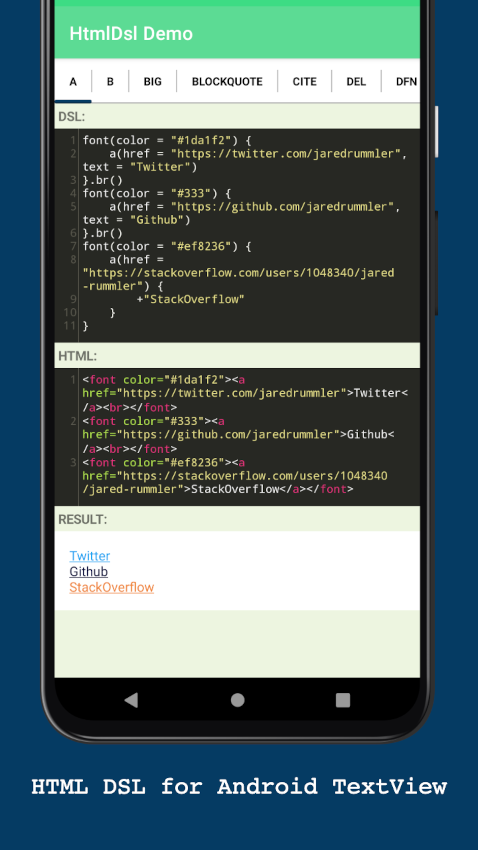

# HTML DSL

**Provides a DSL to build HTML for Android TextView**

<a target="_blank" href="LICENSE"></a>
<a target="_blank" href="https://maven-badges.herokuapp.com/maven-central/com.jaredrummler/htmldsl"></a>
<a target="_blank" href="https://twitter.com/jaredrummler"></a>

### Description

There is a lovely method on the `android.text.Html` class, `fromHtml`, that converts HTML into a `Spannable` for use with a `TextView`.

However, the documentation does not stipulate what HTML tags are supported, which makes this method a bit hit-or-miss. This small library provides a DSL for building valid HTML for `android.widget.TextView`.

## Download

Download [the latest AAR](https://repo1.maven.org/maven2/com/jaredrummler/html-dsl/1.0.0/html-dsl-1.0.0.aar) or grab via Gradle:

```kotlin
implementation("com.jaredrummler:html-dsl:1.0.0")
```

## Structure

* `buildSrc` — Gradle dependencies, plugins, versions
* `library` - The HTML DSL library
* `library/src/test` - Unit tests for the library
* `demo` - Android demo project using HTML DSL
* `scripts` - Scripts to publish library to Maven

----------

## Usage

### Create HTML:

```kotlin
HTML.create {
        h1("HTML DSL")
        strong("Provides a DSL to build HTML for Android TextView")
}
```

### Set HTML on a `TextView`:

```kotlin
textView.setHtml {
    h1("HTML DSL").br()
    strong("Build valid HTML for Android TextView.").br().br()
    h3("Android Versions:")
    ul {
        li {
            a(href = "https://developer.android.com/about/versions/12/get") {
                +"Android 12 Beta"
            }
        }
        li("Android 11")
        li("Android 10")
        li("Pie")
        li("Oreo")
        li("Nougat")
        li("Marshmallow")
        li("Lollipop")
        // ...
    }

    small {
        sub {
            +"by "
            a {
                href = "https://github.com/jaredrummler"
                text = "Jared Rummler"
            }
        }
    }
}
```

### Render HTML to a string

```kotlin
val htmlString = HTML.create {
    p {
        font(face = "monospace", color = "#3ddc84") {
            unsafe {
                +"Lorem ipsum dolor sit amet, consectetur adipiscing elit, sed do eiusmod tempor incididunt ut labore et dolore magna aliqua."
            }
        }
    }
}.render(prettyPrint = true)
```

### Write HTML to a file:

```kotlin
HtmlRenderer<FileWriter>(HTML.create {
    small {
        sub {
            +"by "
            a {
                href = "https://github.com/jaredrummler"
                text = "Jared Rummler"
            }
        }
    }
}, FileWriter("output.html"), true)
```

## Supported HTML elements:

<ul>
  <li><code>&lt;a href=&quot;...&quot;&gt;</code></li>
  <li><code>&lt;b&gt;</code></li>
  <li><code>&lt;big&gt;</code></li>
  <li><code>&lt;blockquote&gt;</code></li>
  <li><code>&lt;br&gt;</code></li>
  <li><code>&lt;cite&gt;</code></li>
  <li><code>&lt;dfn&gt;</code></li>
  <li><code>&lt;div align=&quot;...&quot;&gt;</code></li>
  <li><code>&lt;em&gt;</code></li>
  <li><code>&lt;font color=&quot;...&quot; face=&quot;...&quot;&gt;</code></li>
  <li><code>&lt;h1&gt;</code></li>
  <li><code>&lt;h2&gt;</code></li>
  <li><code>&lt;h3&gt;</code></li>
  <li><code>&lt;h4&gt;</code></li>
  <li><code>&lt;h5&gt;</code></li>
  <li><code>&lt;h6&gt;</code></li>
  <li><code>&lt;i&gt;</code></li>
  <li><code>&lt;img src=&quot;...&quot;&gt;</code></li>
  <li><code>&lt;p&gt;</code></li>
  <li><code>&lt;small&gt;</code></li>
  <li><code>&lt;strike&gt;</code></li>
  <li><code>&lt;strong&gt;</code></li>
  <li><code>&lt;sub&gt;</code></li>
  <li><code>&lt;sup&gt;</code></li>
  <li><code>&lt;tt&gt;</code></li>
  <li><code>&lt;u&gt;</code></li>
  <li><code>&lt;ul&gt;</code></li>
  <li><code>&lt;li&gt;</code></li>
 </ul>
 
 
## License

    Copyright 2021 Jared Rummler

    Licensed under the Apache License, Version 2.0 (the "License");
    you may not use this file except in compliance with the License.
    You may obtain a copy of the License at

       http://www.apache.org/licenses/LICENSE-2.0

    Unless required by applicable law or agreed to in writing, software
    distributed under the License is distributed on an "AS IS" BASIS,
    WITHOUT WARRANTIES OR CONDITIONS OF ANY KIND, either express or implied.
    See the License for the specific language governing permissions and
    limitations under the License.
